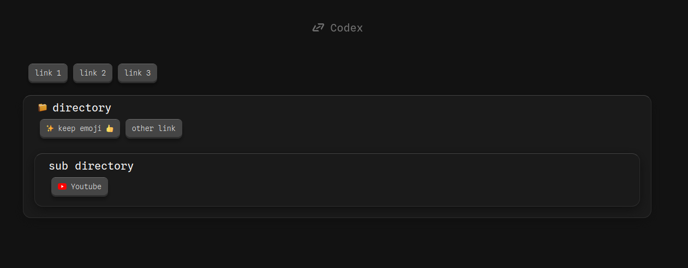

# codex : Linktree as code
Codex is a Linktree-like tool that allows you to build your own link organization, managing images, emojis, directories, etc..

**from a yaml conf :**
```yaml
LINKS:
  link 1: https://
  link 2: https://
  link 3: https://
  directory:
    ✨ keep emoji 👍: https://
    other link: https://
    sub directory:
      Youtube: https://
```
**to a html page :**



---
<br><br><br>

# 🏁 Get started
### 0. prerequis
you must have
- Python3
- ConfigParser : `pip3 install ConfigParser`
- pyyaml : `pip3 install pyyaml`
### 1. Clone this repo
### 2. Codex as command
- `sudo mv -r codex/ /opt/`
- `sudo ln -s /opt/codex/codex /usr/local/bin/codex`
- `sudo chmod +x /opt/codex/codex`
- test by typing `codex`
- `codex cleanup` (to remove all uneccessary stuff from clone)
<br><br><br>


# how use it ?
### 🔗 links structure
- create a directory where to put your config and images (where the html will be built)
- add a `codex.yaml` in your directory, like :
```yaml
LINKS:
  Google: https://www.google.com/
  Entertainment:
    Youtube: https://www.youtube.com/
```
- use `codex build path/to/your/directory` to build the codex.html
> to make this path the default path (so that you no longer need to specify the directory path), simply use `codex set-default <path to the dir>`

### 🖼️ Images
For better organization and beauty, in addition to using emojis, it's possible to put images at the beginning of the links or directories. To do this :
- create `images/` directory in your configuration directory
- Put an image named `<targeted yaml key>.png` in the `images/` directory.
- use `codex build path/to/your/directory` to build the codex.html

> if your `key` is `Youtube` add `Youtube.png` in `your/directory/images/`
