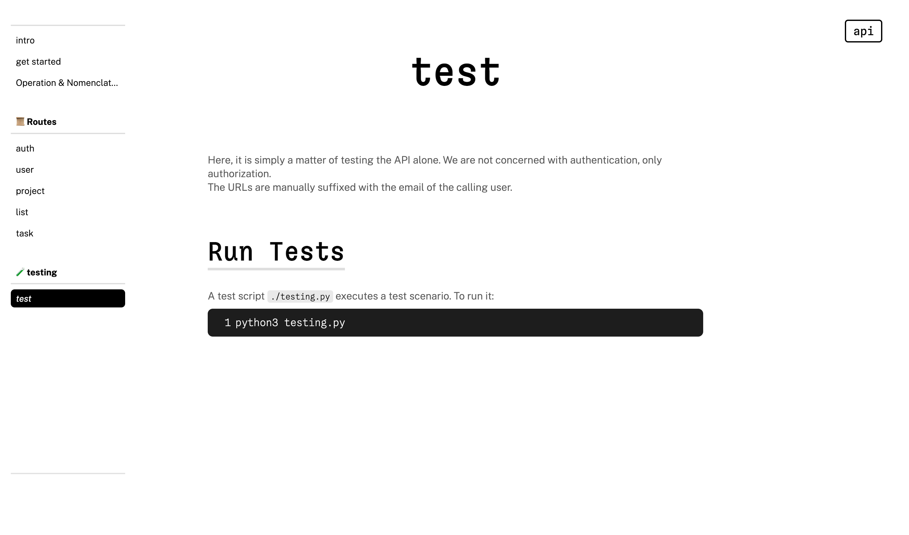
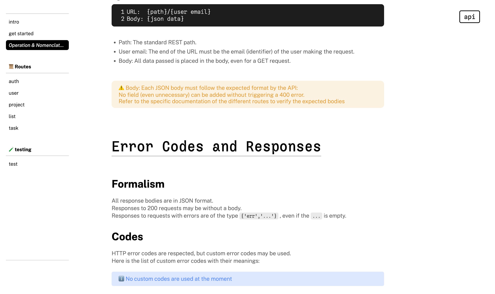
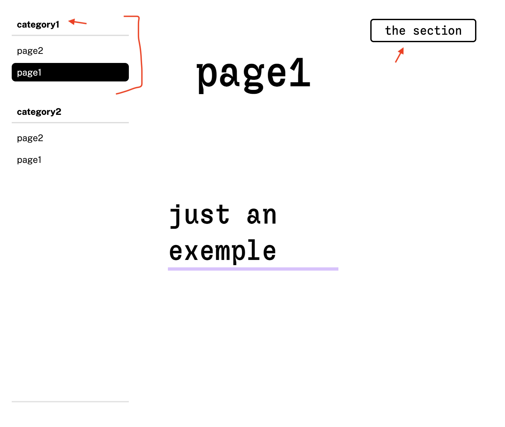
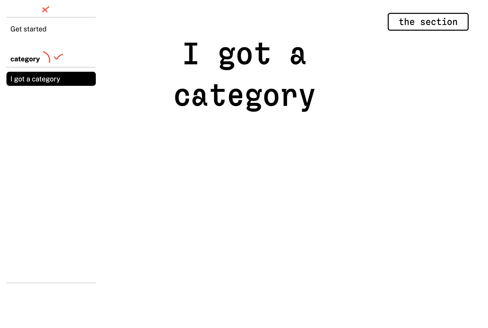

# Codex
 
# Overview
Codex is a documentation generator. It takes markdown files and creates HTML pages, a common feature found in many other tools. So, why use Codex?

The main idea behind Codex is to keep things simple, enabling you to:

- Create your custom markdown syntax in just a few lines.
- Easily override the CSS (HTML is not overly wrapped, making CSS modifications straightforward).
- based on a single python page script

Here's an example of what it looks like with the default user style (and default custom MD syntax):





Additionally, Codex provides (will provide soon...) a ready-to-use GitHub Action configuration file, which allows you to dynamically build your documentation and host it on a GitHub page. This way, you can easily generate documentation for specific sources, such as a website or a local project.


You can try deleting the `./pages/` folder, which contains the already built example documentation. Then, you can try running:
```bash
./build.sh
```
or juste run the `source/code.py`from `.``

a new `./pages/` and `./index.html`  should have been created. Open index.html

---

The documentation is divided into several points:

- #Structure
- #Markdown Pages
- #Custom Markdown Rules (mdX)
- #Custom CSS


# structure
```
.
├── README.md                 # Readme file)
├── build.sh                  # Script to build the documentation)
├── mds                       # Directory containing all your markdown files)
├── rsc                       # Static resources - images, .css, etc.)
└── source
    ├── codex.py              # The main Codex file)
    ├── config.py             # The configuration dictionary file)
    └── mdX.py                # File for declaring custom markdown syntax)

```

The link between different resources, pages, etc., is established using relative paths to ensure it can be built anywhere. Therefore, it is essential not to change this directory structure.

### index.html
It's the home page that redirects to the others pages.

/!\ Cause all the redirections are done using relative paths, it's this page that must be hosted/first-opened.


### css & script
The local scripts should be placed in `rsc/` and specified in config.py using their paths relative to `rsc/` (similarly to local CSS).

### images
The images should be placed in rsc/img/.
To display an image, use the classique markdown syntax, and the alt (in []) will be displayed
# Markdown pages

The documentation is written in markdown and then converted to .html.
Of course, there is a system to organize the different pages.
The organization is done with a depth of 3. /!\ You must maintain this depth! A single page won't work.
```
.
├── section/
│   ├── category1/
│   │   ├── page1
│   │   └── page2
│   │
│   └── catogory2/
│       ├── page1
│       └── page2
│
└── section2/
    └── ...
```
The sections correspond to different parts of the documentation. In section 'X', you will not see the categories/pages of section 'Y'.
The categories are there for organization purposes; they group together related pages.
Here's how it appears on the interface: 



### Ordering ?

To place a section, category, or page before another, the principle is the same: the name of the resource must be written as follows: [resource name].
```
{number}-{resource's name}
```
For example, to have the page 'Z.md' before the page 'A.md':
```
10-Z.md
20-A.md
```
/!\ It is recommended to use values that are not too close to each other to avoid having to rename everything if you want to insert a page between two other pages.

The display name will remain 'Z.md' or 'A.md'.

### Pages sans category ?
It is possible to not want a category for a page (like the introduction page). To achieve this, you simply need to use the previous syntax without specifying a name for the category: [resource name].
```
mds/
└── section/
    └── 10-         # no category for the pages
        └── get started.md
    └── 20-category/
        └── I got a category.md
````
what's give :

However, it is mandatory to have sections.

# Custom markdown suntaxe (mdX)

To create your own Markdown syntax, it's very easy, and some useful custom Markdown syntaxes are already implemented, for example.

Each function in `source/mdX.py` is responsible for interpreting a particular Markdown syntax. 
- They take the Markdown page as a string.
- They parse and modify the page according to the syntax.
- They return a new page with the applied changes.

This is a simple mechanism, but you have the freedom to implement whatever you want. The only constraint is to ensure that the mdX() function returns the parsed page.

The function mdX() is the one that gets called, and it should include all the processing. This allows you to control the order of the treatments.

### exemple :
The `---` in Markdown becomes an `<hr>` (horizontal rule) in HTML.

The idea here is to create a custom syntax that transforms the single `-` into a smaller space than `---`, giving you better control over the spacing.

```python
def small_hr(page:str):
    pattern = r"-\n" # want find get all - lines
    replacement = r"<hr class='small'>\n" # whant to replace by a hr with css class 'small' to create with css a small hr with less margin
    return re.sub(pattern, replacement, page,flags=re.DOTALL) # find, replace, and return the new page
```

# Custom css 

Codex has been designed to produce the simplest possible HTML code. As a result, the HTML code is very straightforward, with generally only 1 md syntax => 1 HTML tag. This simplicity makes CSS customization very easy compared to some generators that encapsulate a lot of elements.

To generate a documentation, you can examine the HTML code for the associated classes and tags of the elements.


